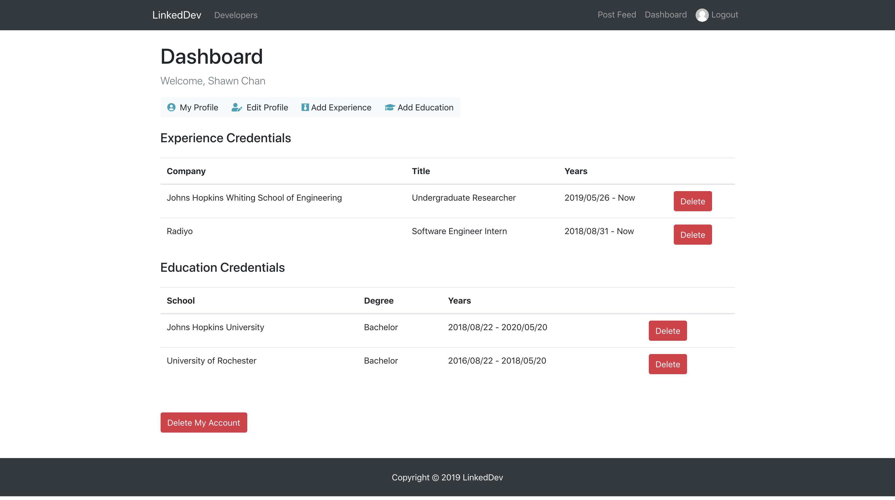

# LinkedDev

A MERN stack web app for developers to connect by creating profiles and making posts and comments.

## Try it

Click [here](https://linkeddev.herokuapp.com/) to try the app:)

## Run it

```javascript
// Clone the repo
git clone https://github.com/shawnchan2014/linked-dev.git

// Get into the project folder
cd linked-dev

// Install dependencies
npm install

// Create a keys_dev.js file under the config folder and put the following code inside it
module.exports = {
  mongoURI: 'YOUR MONGO DB URI',
  secretOrKey: 'YOUR SECRET'
};

// Run the project
npm run dev
```

## Description

- Written in **JavaScript** in **ES6+** versions with a total of around **5000 SLOC**.
- Back-end: modeled the profile and post data with **Mongoose** and **MongoDB**, validated inputs with **Validator**, ensured account information security with **Bcrypt**, and authenticated users with **Passport** and **JSON Web Token (JWT)**.
- Front-end: built UI components with **React** and **Bootstrap 4**, managed application states with **Redux** and **Redux Thunk**, and pulled data from back-end **REST APIs** with the HTTP client **Axios**.
- Testing: extensive back-end API testing with **Postman**, front-end page testing with Redux Chrome Extension.
- Hosting: The app itself is hosted on **Heroku**, while the database is hosted on **MongoDB Atlas**.

## Showcase

Landing page


Sign up page


Dashboard page


My profile page


Developers page


Feed page


Comment page


## Acknowledgement

This is a modified version of the original project called DevConnector from Udemy's [MERN Stack Front To Back: Full Stack React, Redux & Node.js](https://www.udemy.com/mern-stack-front-to-back/) course made by [Brad Traversy](https://www.udemy.com/user/brad-traversy/).

## License

MIT
